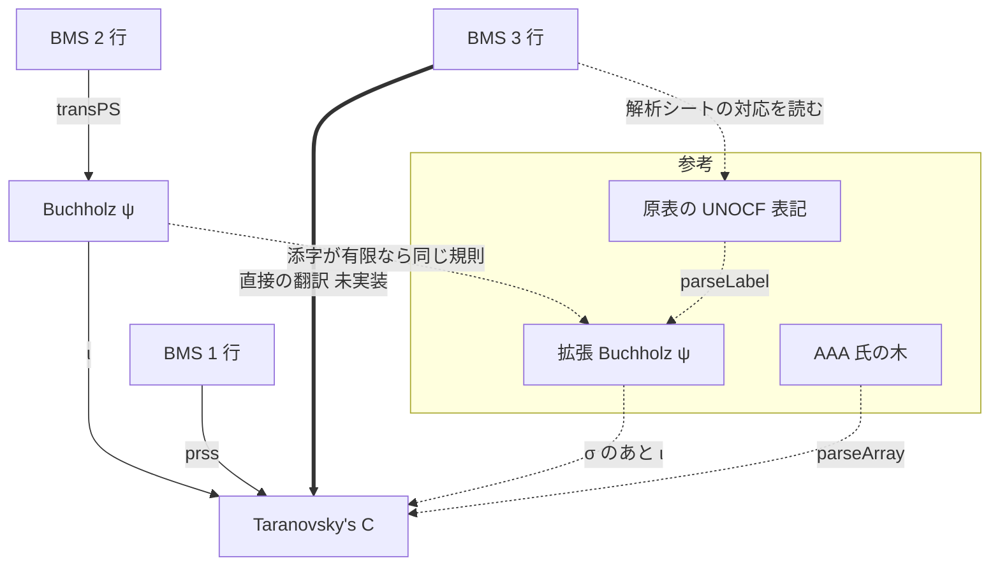
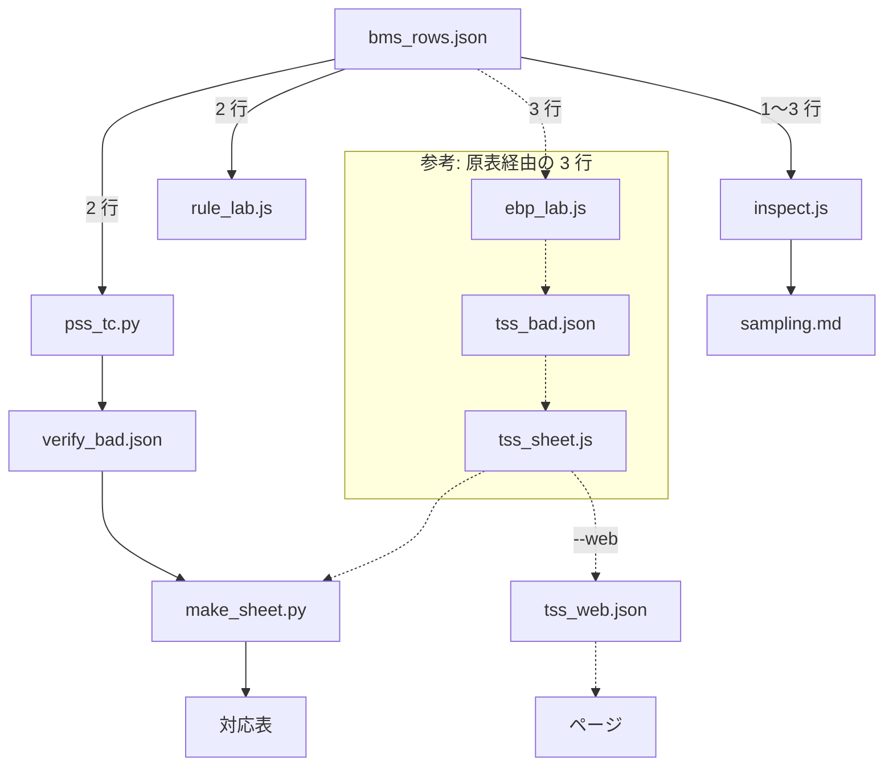
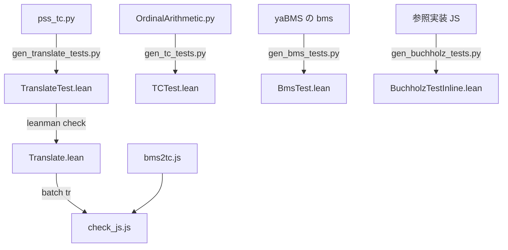

# tools: 表記と変換の地図

[← Back](../README.md)

**目的は、BMS の行列から C の項への全域の翻訳関数を、行列から直接作ること**
（[README.md](../README.md) の「目的」と「作業の決まり」）。

- 3 行の原表経由の道（原表の UNOCF 表記 → 拡張 Buchholz ψ → C）は**参考実装**。原表にある行しか訳せない。
  直接の翻訳の値と比べるためだけに使い、直したり広げたりしない。
- 正しさは BMS と C の側だけで調べる。検査の入力は BMS の展開で作り、原表は抜き取りの見本として使う。

下の図で、四角は表記、矢印は変換。実線は実装済みの翻訳、太線はこれから作る翻訳、点線は参考。
関数名とファイルは図の下の表に書く。

## 表記と翻訳の流れ

表記:

| 表記 | 文字列の例 | 内部表現 | 区分 |
|---|---|---|---|
| BMS 1 行（原始数列） | `(0)(1)(2)` | | 入力 |
| BMS 2 行（ペア数列） | `(0,0)(1,1)` | | 入力 |
| BMS 3 行（トリオ数列） | `(0,0,0)(1,1,1)` | | 入力 |
| Buchholz ψ（添字は有限） | | Lean `Buchholz.BT` / JS `{nu,a}` / Py `('D',nu,a)` | 2 行の中間 |
| Taranovsky's C | `C(C(W_2,W),0)` | Lean `TC.T` / JS `['C',a,b]` / Py `('C',a,b)` | 出力 |
| 原表の UNOCF 表記 | `psi(W_w+W_2)` | 文字列 | 参考 |
| 拡張 Buchholz ψ（添字も項） | | JS `{i,a}`（`ebpsi.js`） | 参考 |
| 有志（AAA 氏）の木 | LaTeX array | | 参考 |

変換:

| 矢印 | 関数 | ファイル | 区分 | 補足 |
|---|---|---|---|---|
| BMS 1 行 → C | `prss` | `Translate.lean`, `bms2tc.js`, `gen_translate_tests.py` | 実装済み | |
| BMS 2 行 → Buchholz ψ | `transPS` | `Buchholz.lean`, `bms2tc.js` | 実装済み | naruyoko 氏 common.js の Trans の移植。参照実装（`BUCHHOLZ_REF_JS`）とも照合する（`pss_tc.py`, `gen_buchholz_tests.py`） |
| Buchholz ψ → C | ι（`iota`） | `Translate.lean`, `bms2tc.js`, `pss_tc.py` | 実装済み | 規則 N2, R2n, R2g, R1d, R2x, R2k, CnAll |
| BMS 3 行 → C | 未定 | 未定 | **これから作る** | 行列から直接。下の「直接の翻訳の作業」 |
| BMS 3 行 → UNOCF 表記 | 解析シートの対応を読む | `sheet/bms_rows.json` | 参考 | 対応は原表の作者の解析による。計算はしない |
| UNOCF 表記 → 拡張 Buchholz ψ | `parseLabel` | `ebpsi.js`, `ebp2tc.js` | 参考 | `fixLabel` で誤記を補正する |
| Buchholz ψ → 拡張 Buchholz ψ | | | 参考 | 添字が有限なら ι の規則は同じ |
| 拡張 Buchholz ψ → C | σ のあと ι | `ebp_sigma.js`, `ebp2tc.js` | 参考 | σ は添字の中の崩壊による値のずれを直す |
| AAA 氏の木 → C | `parseArray` | `aaa_cmp.js` | 参考 | |

## 直接の翻訳の作業

3 行（以上）の翻訳 f を行列から直接作り、BMS と C の側だけで検査する。

### 検査の基準

- f(M) は C の標準形
- 行列の順序と像の順序が一致する: `bcmp M N` と `cmp f(M) f(N)` が同じ
- 極限の行列 M で、f(M[n]) < f(M) かつ `supseq f(M[4]) f(M[5]) f(M[6])` = f(M)

2 行ではこの形の検査を `rule_lab.js` と `pss_tc.py` がしている。3 行の検査もこの形で作る。

### 入力の作り方

- 標準な行列を展開でたどって集める。例: ψ(I) の行列 `(0,0,0)(1,1,1)(2,1,1)(3,1,0)(2,0,0)` から
  `bexp M[1]`, `bexp M[2]`, `bexp M[3]` を再帰的にとる。`rule_lab.js` が 2 行で同じ作り方をしている。
- 原表の 3 行の行は抜き取りの見本として加える（`sheet/bms_rows.json`）。原表だけにしない。

### Lean CLI の一括コマンド

`lean/.lake/build/bin/bms2tc batch` に 1 行 1 コマンドで標準入力から渡す。JS と Python の検査はこれを使う。

| コマンド | 結果 |
|---|---|
| `bstd M` | 行列 M が標準なら `1` |
| `bexp M[n]` | 展開 M[n] |
| `bcmp M N` | 行列の比較 `-1` / `0` / `1` |
| `tr M` | 今の翻訳（1・2 行） |
| `std t` | C の項 t が標準形なら `1` |
| `cmp s t` | C の項の比較 `-1` / `0` / `1` |
| `expand t k` | 基本列 t[k] |
| `isfs s t` | t が s の基本列の要素か |
| `supseq t1 t2 …` | 増加列の上限 |

### 手がかりと参考の値

- 構造からの翻訳: 1 行の `prss` と、有志の断片的な規則 `refs/wiki/alemagno_bms_to_ton.txt`
  （根の列のあとに各要素へ 1 を足した列 X が続く木 → C(f(X), 0)、木の並び → C の鎖をつなぐ、(0,1) → Ω）。
- 和への分解（確認済み）: 行列 M を最後の根（1 行目が 0 の列）の前で M = P + T に分けると、
  f(M) = Cn(log f(T), f(P))。log p は、p = C(a, b) で a < p なら a、そうでなければ p
  （ε_0 = C(Ω_1,0) のような崩壊した値）。Cn は第 2 引数の最小化。対応表の値で、1 行 17 組・2 行 13 組・3 行 8 組すべてで成り立つ。
  → 作るべきものは、根が 1 つの木 T の翻訳。
- 2 行の木の形: 対角 (0,0)(1,1)(2,2)(3,3) ↦ C(C(Ω_2,C(Ω_2,Ω_1)),0) のように、2 行目の親をたどる列ごとに
  C(Ω_2, ·) が 1 つ重なり、1 行目だけの子は C(e, ·) の鎖になる（`tr` の値で観察。規則としては未確認）。
- 列を足したときの変化（`append_lab.js`、2 行、列 12 個以下の 193 組）: 168 組は、f(M) のある部分項 S を
  C(x, S) に置き換えるだけ（Ω_1 = C(Ω_2, 0) と展開して比べる）。x は 0（2 行目が 0 の列）、Ω_2、C(Ω_2, 0)、
  C(Ω_2, C(Ω_2, 0)) など。残り 25 組は、同じ部分項が 2 か所以上に写されていて、全部が一緒に置き換わる（N2 型の写し）。
  → 列ごとに項の中の位置を追い、写しを参照として持つ組み立てで書ける見込み。
- 位置を追った分類（`append_lab.js --track`、`--explain M` で 1 列ずつの経過）:
  - 1 行: 32 組すべてが同じ規則。列 j は、1 行目の親 p1 の付け先の部分項 S を C(0, S) に包み、j の付け先は包んだ節の指数。
  - 2 行（列 12 個以下、111 組中 102 組が 1 か所の包み）: 2 行目が 0 の列は 1 行と同じ（x = 0）。
    2 行目の親 p2 が p1 より上の列は、x = 「j の 1 行目の祖先で p2 のすぐ下の列」の節の写しで p1 の付け先を包み、
    j の子孫はその写しの中に付く（例 (0,0)(1,1)(2,2)(3,1)(4,0) で (4,0) は (3,1) の x の中の Ω_1 を C(0, Ω_1) にする）。
    x = Ω_2 で作った節（Ω̂ の段の目印）は、子を節そのものに付ける。
  - 未整理: p2 = p1 の列（(1,1) 型）の x は、根の子では Ω_2、(3,0) の子では Ω_1 = C(Ω_2, 0) で、段の数え方がまだわからない。
    追跡が切れる 9 組は N2 型（同じ写しが何か所にもあり、後の列がその全部を変える）で、写しを参照として持つ組み立てが要る。
- `direct_lab.js` の現状: 1 行は行列 98 個（極限 97 個）すべてが検査を通る。2 行は木の規則がなく 575 個中 574 個が未翻訳。
- 目印の値: (0,0,0)(1,1,1) ↦ C(C(C(0,Ω_2),0),0)、ψ(I) の行列 ↦ C(C(C(Ω_2,Ω_2),0),0)。
- 比べる値（参考）: 原表経由の値 `sheet/tc_map.json`、3 行 BMS と C の有志の対応表 `refs/wiki/dan_3row.txt`。
  食い違ったら上の検査で決める。
- 行き止まり: f(M) = sup f(M[n]) の再帰だけで訳す `discover.py` は、計算量が爆発して中止した。

## 各表記の中での操作

| 表記 | 操作 | 関数・ファイル | 補足 |
|---|---|---|---|
| BMS | 展開 M[n] | `Bms.lean` expand, `bms_ref.py` | |
| BMS | 比較・標準形 | `Bms.lean` compare, isStandard | |
| C | 比較・標準形 | `TC.lean` cmp, isStandard, `bms2tc.js` cmp | 比較は postfix の辞書式 |
| C | 基本列 α[k] | `TC.lean` expand | Hyp cos の定義 |
| C | 上限 supseq | `TC.lean` supSeqAuto | 増加列の上限 |
| 拡張 Buchholz ψ（参考） | 基本列・dom | `ebpsi.js` fs, dom | |
| 拡張 Buchholz ψ（参考） | 正規形・順序・演算 | `ebpsi.js` isStd, cmp, add, mul, pow | 演算は + × ^ |

## 検査と表の生成

| ノード | ファイル | 中身 |
|---|---|---|
| bms_rows.json | `sheet/bms_rows.json` | 原表 xlsx の BMS 列と UNOCF 列 |
| pss_tc.py | `tools/pss_tc.py` | 2 行: 標準形・順序・f(M[n]) < f(M)・共終性 |
| rule_lab.js | `tools/rule_lab.js` | 2 行: 規則スイッチと上限探索。展開でたどった行列も検査する |
| inspect.js | `tools/inspect.js` | 大きさの区間ごとのエラー数（3 行は参考実装の値） |
| verify_bad.json | `sheet/verify_bad.json` | 2 行の検査で見つかった悪い行 |
| sampling.md | `sampling.md` | 区間ごとのエラー数の表 |
| make_sheet.py | `tools/make_sheet.py` | 対応表の生成 |
| 対応表 | `sheet/README.md`, `README-en.md`, `rows3-*.md`, `table.tsv`, `tc_map.json` | |
| ebp_lab.js | `tools/ebp_lab.js` | 参考: 3 行、ψ 側の基本列で上限探索、隣の行との順序 |
| tss_bad.json | `sheet/tss_bad.json` | 参考: 3 行の検査で指摘があった行 |
| tss_sheet.js | `tools/tss_sheet.js` | 参考: 3 行、表記 → 拡張 Buchholz ψ → C |
| tss_web.json | `sheet/tss_web.json` | 参考: `tss_sheet.js --web` が書くページ用の表 |
| ページ | `index.html`, `main.js` | 1・2 行は `bms2tc.js`、3 行は `tss_web.json` を引くだけ |

Lean と JS と Python の実装が同じ結果を出すことは次で確かめる。

- テストの Lean ファイルは `lean/tests/` にある。`TranslateTest.lean` は #guard 441 件。
- `pss_tc.py` は Python の規則。`OrdinalArithmetic.py` は Taranovsky の Python 実装。
- yaBMS の `bms` は `YABMS_BMS`、参照実装 JS は `BUCHHOLZ_REF_JS` で指定する。

## ファイル一覧

区分: **直接** = 行列から直接の翻訳とその検査、**共通** = 表記の実装や表の生成、**参考** = 原表経由の 3 行、**旧** = 使っていない。

| ファイル | 区分 | 役割 |
|---|---|---|
| `../direct.js` | 直接 | 行列から直接の翻訳（作業中）。和の分解と 1 行の木の規則。2 行以上の木はまだ null |
| `direct_lab.js` | 直接 | `direct.js` の検査台。BMS の展開で集めた行列（接頭辞も含む）で、`tr` との一致（1・2 行）、標準形、辞書式で隣の行列との順序、上限一致を調べる |
| `append_lab.js` | 直接 | 解析: 行列に列を 1 つ足したときの C の項の変化を、部分項 S → C(x, S) の置き換えとして分類する。`--track` で各列の項の中の位置を追って親の位置からの相対で分類、`--explain M` で 1 列ずつの経過を出す |
| `pss_tc.py` | 直接 | 2 行の規則の Python 版と機械検査（`sheet/verify_bad.json` を書く） |
| `rule_lab.js` | 直接 | 2 行の規則の実験台（`bms2tc.js` の `RULES` を切り替え、上限探索と比べる） |
| `check_js.js` | 直接 | `bms2tc.js` と Lean CLI の照合 |
| `gen_translate_tests.py` | 直接 | 翻訳（Python 規則）のテスト生成 |
| `gen_buchholz_tests.py` | 直接 | PSS → Buchholz のテスト生成 |
| `gen_tc_tests.py` | 共通 | TC の標準形・比較・基本列のテスト生成 |
| `gen_bms_tests.py`, `bms_ref.py` | 共通 | BMS 展開のテスト生成と Python の参照実装 |
| `make_sheet.py` | 共通 | 対応表の生成 |
| `inspect.js` | 共通 | 数値検証のエラー数を大きさの区間ごとに数え、`sampling.md` を書く（3 行は参考実装の値） |
| `ebp_lab.js` | 参考 | 拡張 Buchholz ψ → C の検査（`--labels` で任意の表記、`--bad` で `sheet/tss_bad.json`） |
| `../ebp_sigma.js` | 参考 | 写像 σ の本体（原表経由の 3 行の翻訳は f = ι∘σ。`tss_sheet.js` と `ebp_lab.js` が使う） |
| `sigma_lab.js` | 参考 | 写像 σ の設定を変えて原表の行で試す（本番の設定は `--auto --normall --virtual --eorig +R2nu`） |
| `ebp_std_rule.js` | 参考 | 拡張 Buchholz ψ の項が C の標準形に写るかを規則 R4 で判定し、実際の標準形判定と照合する |
| `tss_sheet.js` | 参考 | 3 行の行の翻訳（原表の表記経由）。`--web` でページ用の表 |
| `psi_i_sup.js` | 参考 | ψ(I) の像を上限探索で確かめる |
| `aaa_cmp.js` | 参考 | 有志（AAA 氏）の拡張 Buchholz ψ と C の対応表との照合 |
| `supfix.py` | 旧 | 旧版の上限候補による補正（`rule_lab.js` に置き換え） |
| `discover.py` | 旧 | 上限だけで翻訳を探す試み（計算量が爆発するため中止） |

環境変数: `BUCHHOLZ_REF_JS`（PSS → Buchholz の参照 JS）、`YABMS_BMS`（yaBMS の `bms`）。
