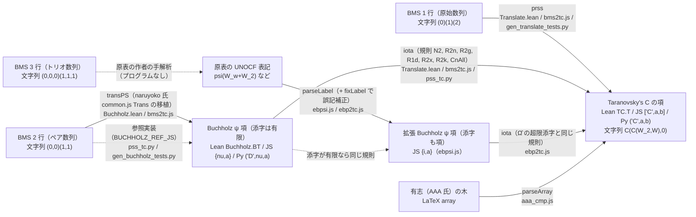
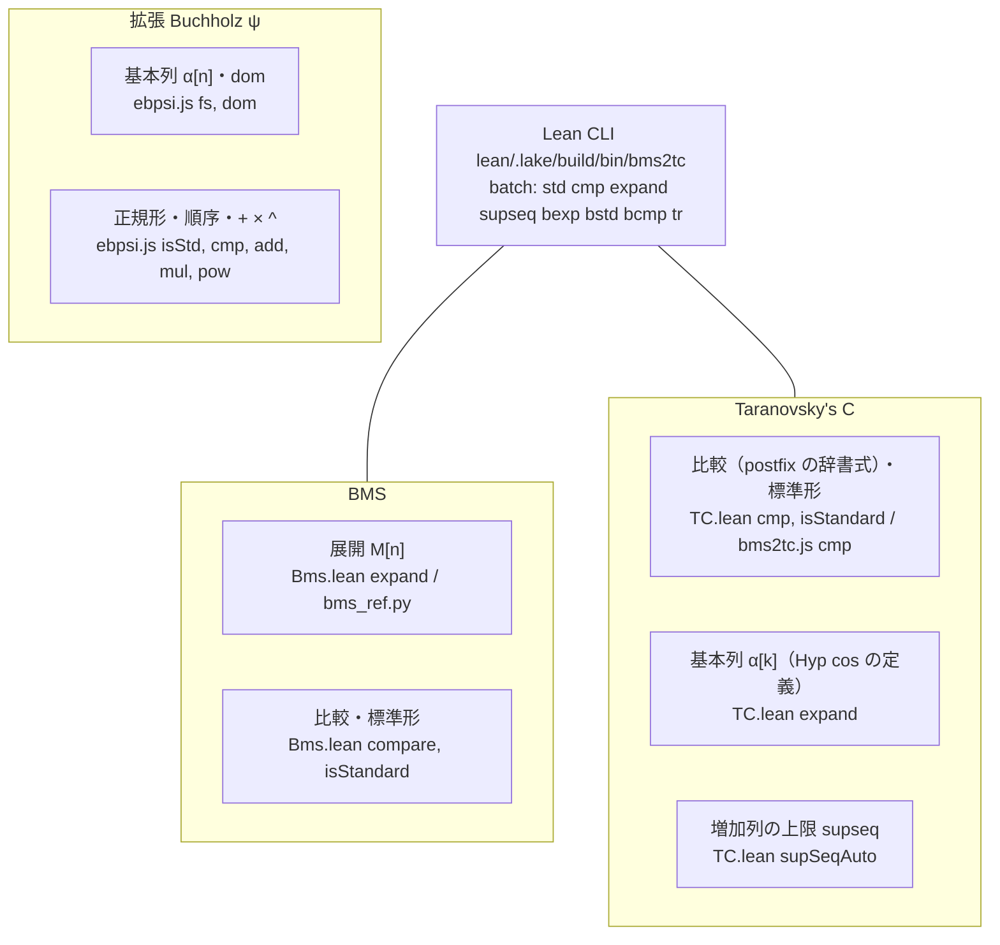
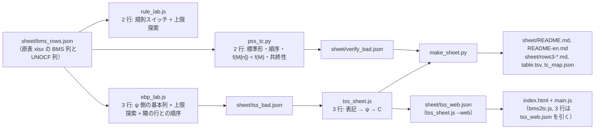
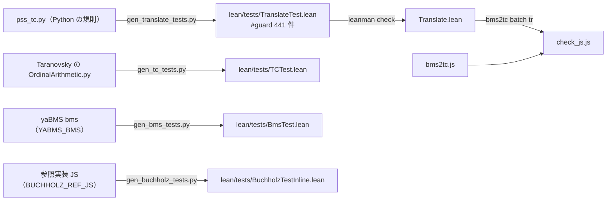

# tools: 表記と変換の地図

[← Back](../README.md)

このリポジトリには表記が 6 種類あり、実装も Lean・JS・Python に分かれている。
下の図で、四角は表記（とその内部表現）、矢印は変換（関数名とファイル）。

## 表記と翻訳の流れ

- 1 行と 2 行は行列から直接翻訳する（`bms2tc`）。
- 3 行は行列を読まず、原表の UNOCF 表記を経由する（`tools/tss_sheet.js`）。原表にない行は訳せない。

## 各表記の中での操作

JS と Python のツールは、Lean の計算（比較、標準形、基本列、上限、BMS 展開）を
`bms2tc batch` に標準入力で一括して問い合わせる。

## 検査と表の生成

Lean と JS と Python の実装が同じ結果を出すことは次で確かめる。

## ファイル一覧

| ファイル | 役割 |
|---|---|
| `pss_tc.py` | 2 行の規則の Python 版と機械検査（`sheet/verify_bad.json` を書く） |
| `rule_lab.js` | 2 行の規則の実験台（`bms2tc.js` の `RULES` を切り替え、上限探索と比べる） |
| `ebp_lab.js` | 拡張 Buchholz ψ → C の検査（`--labels` で任意の表記、`--bad` で `sheet/tss_bad.json`） |
| `tss_sheet.js` | 3 行の行の翻訳（原表の表記経由）。`--web` でページ用の表 |
| `psi_i_sup.js` | ψ(I) の像を上限探索で確かめる |
| `aaa_cmp.js` | 有志（AAA 氏）の拡張 Buchholz ψ と C の対応表との照合 |
| `supfix.py` | 旧版の上限候補による補正（`rule_lab.js` に置き換え） |
| `make_sheet.py` | 対応表の生成 |
| `check_js.js` | `bms2tc.js` と Lean CLI の照合 |
| `gen_tc_tests.py` | TC の標準形・比較・基本列のテスト生成 |
| `gen_bms_tests.py`, `bms_ref.py` | BMS 展開のテスト生成と Python の参照実装 |
| `gen_buchholz_tests.py` | PSS → Buchholz のテスト生成 |
| `gen_translate_tests.py` | 翻訳（Python 規則）のテスト生成 |
| `discover.py` | 上限だけで翻訳を探す試み（計算量が爆発するため中止） |

環境変数: `BUCHHOLZ_REF_JS`（PSS → Buchholz の参照 JS）、`YABMS_BMS`（yaBMS の `bms`）。
