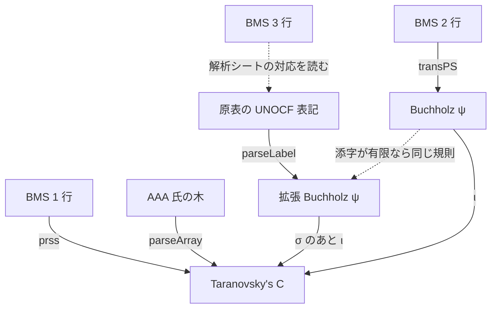
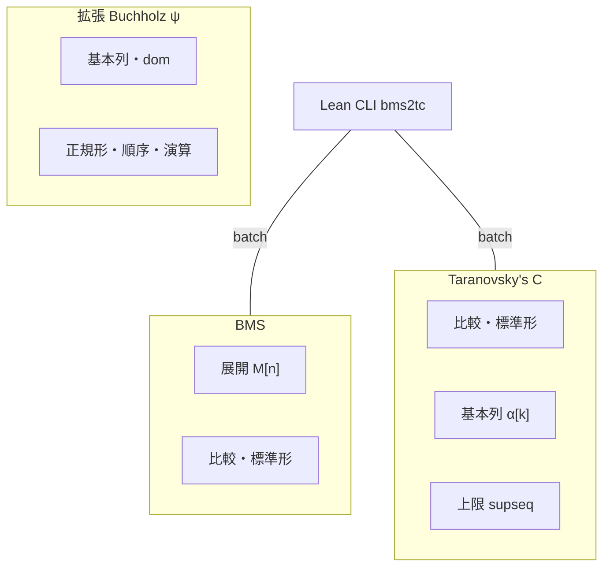
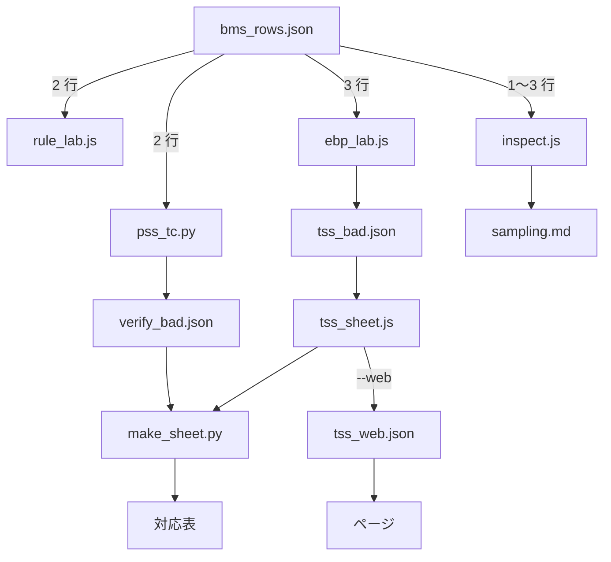
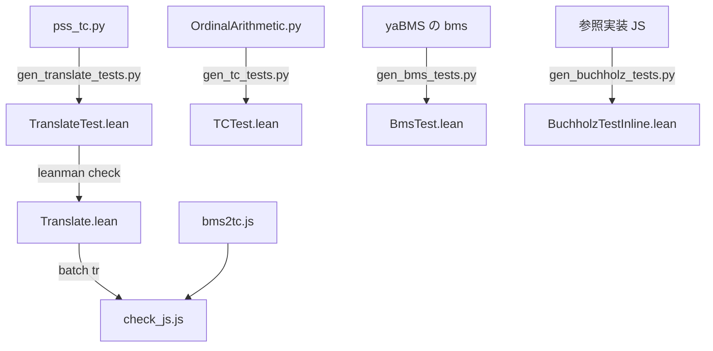

# tools: 表記と変換の地図

[← Back](../README.md)

このリポジトリには表記が 6 種類あり、実装も Lean・JS・Python に分かれている。
下の図で、四角は表記、矢印は変換。関数名とファイルは図の下の表に書く。

## 表記と翻訳の流れ

表記:

| 表記 | 文字列の例 | 内部表現 |
|---|---|---|
| BMS 1 行（原始数列） | `(0)(1)(2)` | |
| BMS 2 行（ペア数列） | `(0,0)(1,1)` | |
| BMS 3 行（トリオ数列） | `(0,0,0)(1,1,1)` | |
| 原表の UNOCF 表記 | `psi(W_w+W_2)` | 文字列 |
| Buchholz ψ（添字は有限） | | Lean `Buchholz.BT` / JS `{nu,a}` / Py `('D',nu,a)` |
| 拡張 Buchholz ψ（添字も項） | | JS `{i,a}`（`ebpsi.js`） |
| Taranovsky's C | `C(C(W_2,W),0)` | Lean `TC.T` / JS `['C',a,b]` / Py `('C',a,b)` |
| 有志（AAA 氏）の木 | LaTeX array | |

変換:

| 矢印 | 関数 | ファイル | 補足 |
|---|---|---|---|
| BMS 1 行 → C | `prss` | `Translate.lean`, `bms2tc.js`, `gen_translate_tests.py` | |
| BMS 2 行 → Buchholz ψ | `transPS` | `Buchholz.lean`, `bms2tc.js` | naruyoko 氏 common.js の Trans の移植。参照実装（`BUCHHOLZ_REF_JS`）とも照合する（`pss_tc.py`, `gen_buchholz_tests.py`） |
| Buchholz ψ → C | ι（`iota`） | `Translate.lean`, `bms2tc.js`, `pss_tc.py` | 規則 N2, R2n, R2g, R1d, R2x, R2k, CnAll |
| BMS 3 行 → UNOCF 表記 | 解析シートの対応を読む | `sheet/bms_rows.json` | 対応は原表の作者の解析による。計算はしない |
| UNOCF 表記 → 拡張 Buchholz ψ | `parseLabel` | `ebpsi.js`, `ebp2tc.js` | `fixLabel` で誤記を補正する |
| Buchholz ψ → 拡張 Buchholz ψ | | | 添字が有限なら ι の規則は同じ |
| 拡張 Buchholz ψ → C | σ のあと ι | `ebp_sigma.js`, `ebp2tc.js` | σ は添字の中の崩壊による値のずれを直す |
| AAA 氏の木 → C | `parseArray` | `aaa_cmp.js` | |

- 1 行と 2 行は行列から直接翻訳する（`bms2tc`）。
- 3 行は行列を読まず、原表の UNOCF 表記を経由する（`tools/tss_sheet.js`）。原表にない行は訳せない。

## 各表記の中での操作

| 表記 | 操作 | 関数・ファイル | 補足 |
|---|---|---|---|
| BMS | 展開 M[n] | `Bms.lean` expand, `bms_ref.py` | |
| BMS | 比較・標準形 | `Bms.lean` compare, isStandard | |
| C | 比較・標準形 | `TC.lean` cmp, isStandard, `bms2tc.js` cmp | 比較は postfix の辞書式 |
| C | 基本列 α[k] | `TC.lean` expand | Hyp cos の定義 |
| C | 上限 supseq | `TC.lean` supSeqAuto | 増加列の上限 |
| 拡張 Buchholz ψ | 基本列・dom | `ebpsi.js` fs, dom | |
| 拡張 Buchholz ψ | 正規形・順序・演算 | `ebpsi.js` isStd, cmp, add, mul, pow | 演算は + × ^ |

Lean CLI は `lean/.lake/build/bin/bms2tc`。`batch` のコマンドは std, cmp, expand, supseq, bexp, bstd, bcmp, tr。
JS と Python のツールは、Lean の計算（比較、標準形、基本列、上限、BMS 展開）を
`bms2tc batch` に標準入力で一括して問い合わせる。

## 検査と表の生成

| ノード | ファイル | 中身 |
|---|---|---|
| bms_rows.json | `sheet/bms_rows.json` | 原表 xlsx の BMS 列と UNOCF 列 |
| pss_tc.py | `tools/pss_tc.py` | 2 行: 標準形・順序・f(M[n]) < f(M)・共終性 |
| rule_lab.js | `tools/rule_lab.js` | 2 行: 規則スイッチと上限探索 |
| ebp_lab.js | `tools/ebp_lab.js` | 3 行: ψ 側の基本列で上限探索、隣の行との順序 |
| inspect.js | `tools/inspect.js` | 大きさの区間ごとのエラー数 |
| verify_bad.json, tss_bad.json | `sheet/` | 検査で見つかった悪い行 |
| tss_sheet.js | `tools/tss_sheet.js` | 3 行: 表記 → 拡張 Buchholz ψ → C |
| sampling.md | `sampling.md` | 区間ごとのエラー数の表 |
| make_sheet.py | `tools/make_sheet.py` | 対応表の生成 |
| 対応表 | `sheet/README.md`, `README-en.md`, `rows3-*.md`, `table.tsv`, `tc_map.json` | |
| tss_web.json | `sheet/tss_web.json` | `tss_sheet.js --web` が書くページ用の表 |
| ページ | `index.html`, `main.js` | 1・2 行は `bms2tc.js`、3 行は `tss_web.json` を引く |

Lean と JS と Python の実装が同じ結果を出すことは次で確かめる。

- テストの Lean ファイルは `lean/tests/` にある。`TranslateTest.lean` は #guard 441 件。
- `pss_tc.py` は Python の規則。`OrdinalArithmetic.py` は Taranovsky の Python 実装。
- yaBMS の `bms` は `YABMS_BMS`、参照実装 JS は `BUCHHOLZ_REF_JS` で指定する。

## ファイル一覧

| ファイル | 役割 |
|---|---|
| `pss_tc.py` | 2 行の規則の Python 版と機械検査（`sheet/verify_bad.json` を書く） |
| `rule_lab.js` | 2 行の規則の実験台（`bms2tc.js` の `RULES` を切り替え、上限探索と比べる） |
| `ebp_lab.js` | 拡張 Buchholz ψ → C の検査（`--labels` で任意の表記、`--bad` で `sheet/tss_bad.json`） |
| `../ebp_sigma.js` | 写像 σ の本体（3 行の翻訳は f = ι∘σ。`tss_sheet.js` と `ebp_lab.js` が使う） |
| `sigma_lab.js` | 実験: 写像 σ（f = ι∘σ）の設定を変えて原表の行で試す（本番の設定は `--auto --normall --virtual --eorig +R2nu`）（`--off` で今の ι、`--low` で低い崩壊の中にも適用、`--k2` で Ω_{Ω_3} の段にも適用、`--eorig` で最後の低い項の R2n の E を σ の前の引数から作る、`+R2nu` で `ebp2tc.js` の規則 R2nu を有効化） |
| `ebp_std_rule.js` | 拡張 Buchholz ψ の項が C の標準形に写るかを規則 R4 で判定し、実際の標準形判定と照合する（ずれの原因の切り分け用） |
| `tss_sheet.js` | 3 行の行の翻訳（原表の表記経由）。`--web` でページ用の表 |
| `inspect.js` | 数値検証のエラー数を大きさの区間ごとに数え、`sampling.md` を書く |
| `psi_i_sup.js` | ψ(I) の像を上限探索で確かめる |
| `aaa_cmp.js` | 有志（AAA 氏）の拡張 Buchholz ψ と C の対応表との照合 |
| `supfix.py` | 旧版の上限候補による補正（`rule_lab.js` に置き換え） |
| `make_sheet.py` | 対応表の生成 |
| `check_js.js` | `bms2tc.js` と Lean CLI の照合 |
| `gen_tc_tests.py` | TC の標準形・比較・基本列のテスト生成 |
| `gen_bms_tests.py`, `bms_ref.py` | BMS 展開のテスト生成と Python の参照実装 |
| `gen_buchholz_tests.py` | PSS → Buchholz のテスト生成 |
| `gen_translate_tests.py` | 翻訳（Python 規則）のテスト生成 |
| `discover.py` | 上限だけで翻訳を探す試み（計算量が爆発するため中止） |

環境変数: `BUCHHOLZ_REF_JS`（PSS → Buchholz の参照 JS）、`YABMS_BMS`（yaBMS の `bms`）。
